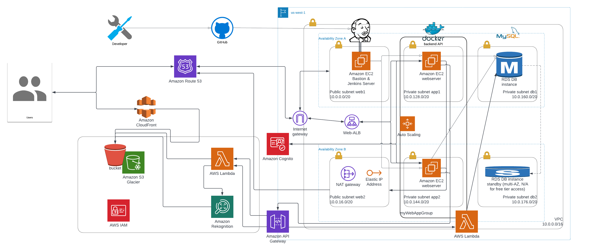
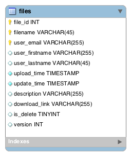

# Project #2-zisyang-Foto2Recipes
- University Name: [San Jose State University](http://www.sjsu.edu/)
- Course: [CMPE 281 - Cloud Technologies](http://info.sjsu.edu/web-dbgen/catalog/courses/CMPE281.html)
- Professor: [Sanjay Garje](https://www.linkedin.com/in/sanjaygarje/)
- Student: [Zi Shun Yang](https://www.linkedin.com/in/zi-s-yang-1b764560/)


## Project Introduction
People often take photos when they are in restaurants, and share the pictures of their favorite food to social media. Friends of theirs could bring up some idea or question like: Given a picture of food, what else can you cook using the same ingredients? Which means that, what recipes can you make with the food from the kitchen? 
So, the idea of this project is to let users upload a picture of the food, then using AWS Rekognition to find out what the ingredients contain in the picture by labeling, then parse them to the ML model API to find recommended recipes for the users.

## Table of content
  - [Project Introduction](#project-introduction)
  - [Features](#features)
  - [Sample Demo Screenshots](#sample-demo-screenshots)
  - [Architecture Diagram](#architecture-diagram)
  - [Pre-requisites Set Up](#pre-requisites-set-up)
    - [AWS Services](#aws-services)
    - [Required Tools Install Locally](#required-tools-install-locally)
    - [Tree of code](#tree-of-code)
  - [Database setup](#database-setup)
    - [ERR Diagram](#err-diagram)
    - [MYSQL Table](#mysql-table)
  - [Site setup](#site-setup)
    - [How to set up and run project locally?](#how-to-set-up-and-run-project-locally)
  - [Website URL](#website-url)
  - [Reference Links](#reference-links)


## Features
- Users Login
- Admin Login
- Users upload image files, (max size 10 MB per file)
- Users/Admin can browse through already uploaded list of files
- Users/Admin can download uploaded file
- Users can uploaded new version of file
- Users/Admin can delete already uploaded file
- Users can select the uploaded image file for recipes recommandations
- Users can see a list of top 5 recommanded recipes
- Users can see a list of the ingredients for each recipe
- Users can click the link to external site for recipe detail 


## Sample Demo Screenshots


## Architecture Diagram



## Pre-requisites Set Up

### AWS Services
- Cognito
- VPC
- EC2
- AutoScaling Group
- ELB
- Single AZ RDS
- Lambda
- API Gateway
- IAM
- S3
- Rekognition 
- CloudFront
- Route 53
- CloudWatch
- AWS S3 presigned URLs with SAM
- AWS SDK

### Required Tools Install Locally
- AWS CLI
- AWS SAM CLI
- NodeJS
- Docker
- Git
- Httpd
- Mysql
- MySQLWorkbench
- VSCode

### Tree of code
```
.
├── lambda/            <-- This contains codes to run in each Lambda functions
├── rds/SQL/           <-- This contains script to initialize the database & creat table
├── webapp/app/        <-- This is to run in app-tier EC2 instances 
├── webapp/web/        <-- This is to run in web-tier EC2 instances
```

## Database setup

### ERR Diagram


### MYSQL Table
```
DESC files;
| Field          | Type         | Null | Key | Default | Extra          |
+----------------+--------------+------+-----+---------+----------------+
| file_id        | int          | NO   | PRI | NULL    | auto_increment |
| filename       | varchar(45)  | NO   | PRI | NULL    |                |
| user_email     | varchar(255) | NO   | PRI | NULL    |                |
| user_firstname | varchar(255) | YES  |     | NULL    |                |
| user_lastname  | varchar(45)  | YES  |     | NULL    |                |
| upload_time    | timestamp    | NO   |     | NULL    |                |
| update_time    | timestamp    | NO   |     | NULL    |                |
| description    | varchar(255) | YES  |     | NULL    |                |
| download_link  | varchar(45)  | YES  |     | NULL    |                |
| is_delete      | tinyint      | YES  |     | 0       |                |
| version        | int          | YES  |     | NULL    |                |
```
### MYSQL Initial Script
```
rds/SQL/createinitialsetup.sql
```

## Site setup

To setup the backend (Amazon Linux in EC2):
```
#recipes backend api 
cd webapp/backendapi/
sh setup.sh
```

To setup Frontend (Amazon Linux in EC2):
```
#web frontend
yum install httpd.x86_64 -y
systemctl start httpd
systemctl enable httpd
cd /tmp
git clone https://github.com/zisyang/281proj2.git
cp -a /tmp/281proj2/webapp/web/* /var/www/html/
```

### How to set up and run project locally?

Run backend (Linux):
```
#recipes backend api 
cd webapp/backendapi/
sh setup.sh
```

Run frontend (Linux):
```
#web frontend
yum install httpd.x86_64 -y
systemctl start httpd
systemctl enable httpd
cd /tmp
git clone https://github.com/zisyang/281proj2.git
cp -a /tmp/281proj2/webapp/web/* /var/www/html/
```

## Website URL
http://281proj2.team-strikers.link


## Reference Links

- https://aws.amazon.com/blogs/compute/uploading-to-amazon-s3-directly-from-a-web-or-mobile-application/
- https://docs.aws.amazon.com/rekognition/latest/dg/images-s3.html
- https://docs.aws.amazon.com/rekognition/latest/dg/labels-detect-labels-image.html
- https://docs.aws.amazon.com/rekognition/latest/customlabels-dg/ex-lambda.html
- https://www.amazon.science/blog/using-food-images-to-find-cooking-recipes
- https://towardsdatascience.com/building-a-recipe-recommendation-system-297c229dda7b
- https://hub.docker.com/r/jackmleitch/whatscooking
- https://www.allrecipes.com/recipes/
- https://www.jamieoliver.com/recipes/
